# 📱 Project Flutter: Hello World  

Laporan ini berisi dokumentasi langkah-langkah praktikum Flutter dari membuat project baru hingga menerapkan berbagai widget dasar, Material Design, dan Cupertino.

---

## 📝 Praktikum 1: Membuat Project Flutter Baru  

1. Buka **Command Palette** di VS Code, ketik `Flutter`, lalu pilih **Flutter: New Project**.  
   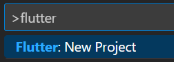  

2. Pilih **Application**.  
   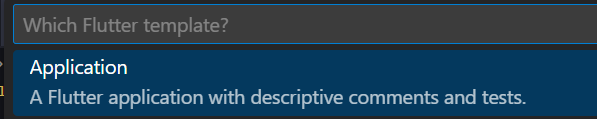  

3. Tentukan folder penyimpanan, misalnya dengan nama `hello_world`.  
   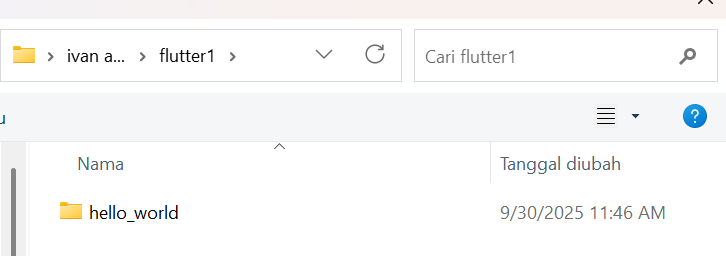  

4. Flutter siap digunakan untuk project Anda.  
     

---

## 🖥️ Praktikum 2: Setup Emulator  

1. Gunakan **Android Studio** untuk emulator.  
   - Masuk ke menu **Settings** lalu unduh SDK dan plugin yang dibutuhkan.  
   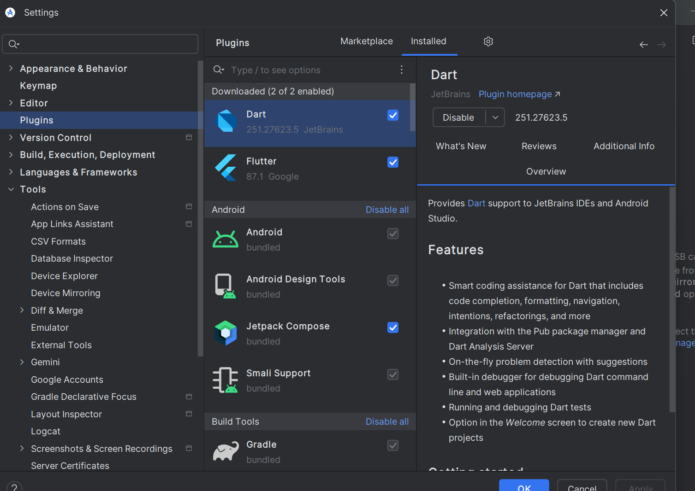  

2. Emulator dapat dikustomisasi, contoh tampilan yang dipakai:  
   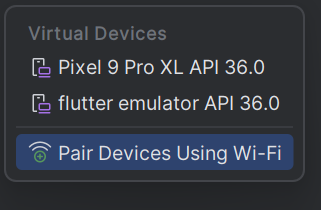  

3. Jalankan emulator untuk mengetes apakah sudah berfungsi.  
   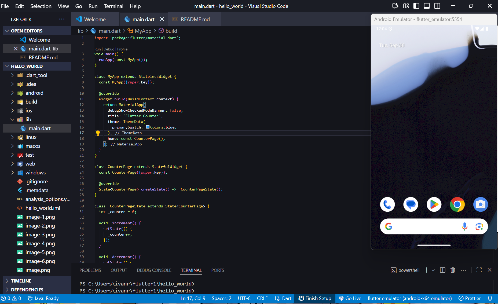  

4. Aplikasi Flutter berhasil dijalankan di emulator.  
   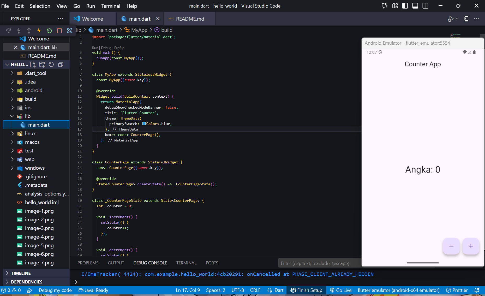  

---

## 🌐 Praktikum 3: Membuat Repository & Laporan  

1. Buat **repository baru** di GitHub.  
   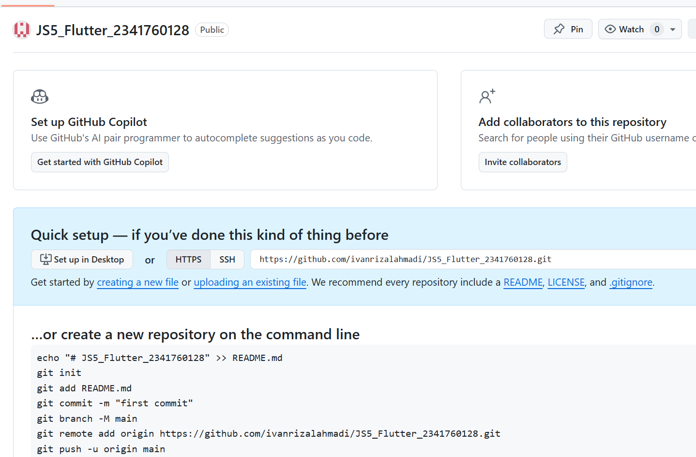  

2. Hubungkan project `hello_world` dengan repository.  
   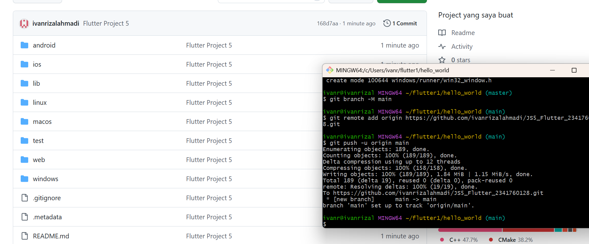  

---

## 🧩 Praktikum 4: Menerapkan Widget Dasar  

1. Buat folder `basic_widgets` lalu tambahkan file baru.  
     

2. Contoh **Text Widget**:  
   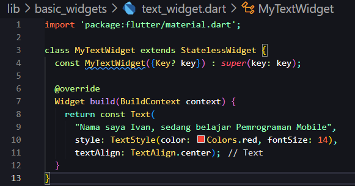  

3. Modifikasi `main.dart` untuk memanggil widget.  
   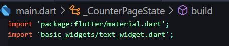  
   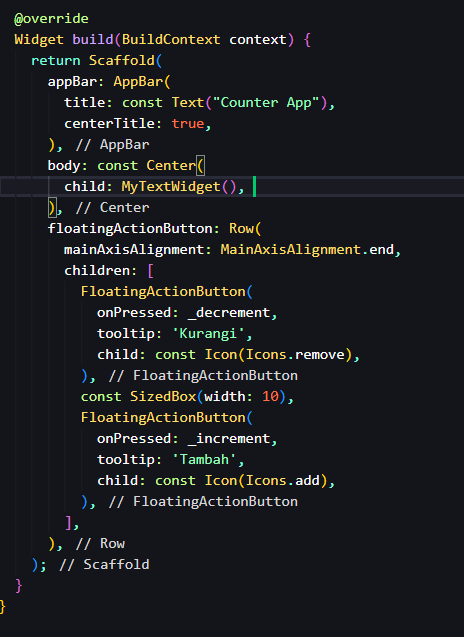  

4. **Output Text Widget:**  
     

5. Menambahkan **Image Widget**:  
   - Buat file baru untuk widget gambar.  
     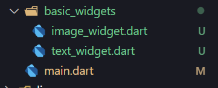  
   - Tambahkan folder `assets` dan atur di `pubspec.yaml`.  
     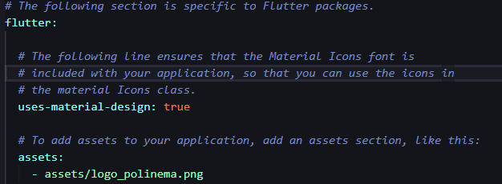  
   - Isi file widget sesuai kode.  
     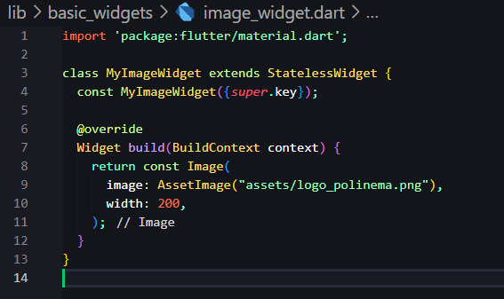  
   - Modifikasi `main.dart`.  
     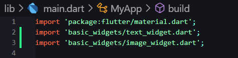  
     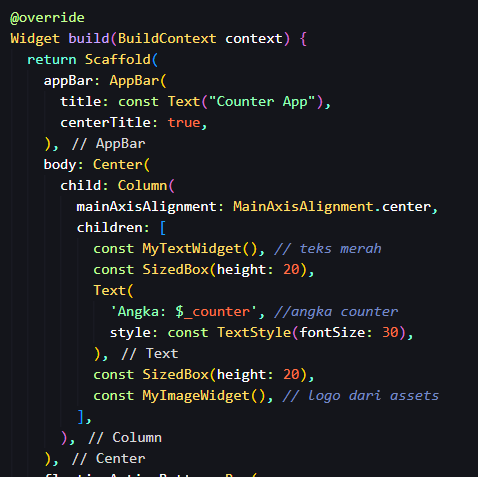  

6. **Output Image Widget:**  
     

---

## 🎨 Praktikum 5 (Langkah 1 dan 2): Material Design & Cupertino  

1. Buat file baru di folder `basic_widgets`:  
   - **Cupertino Widget**  
   - **Floating Action Button (FAB)**  
   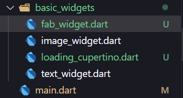  

2. **Output Cupertino Widget:**  
   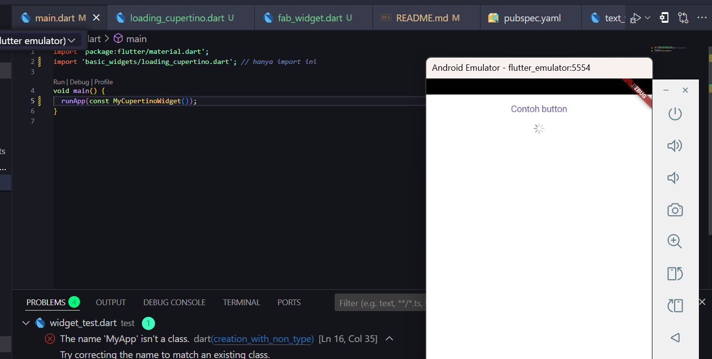  

3. **Output FAB Widget:**  
   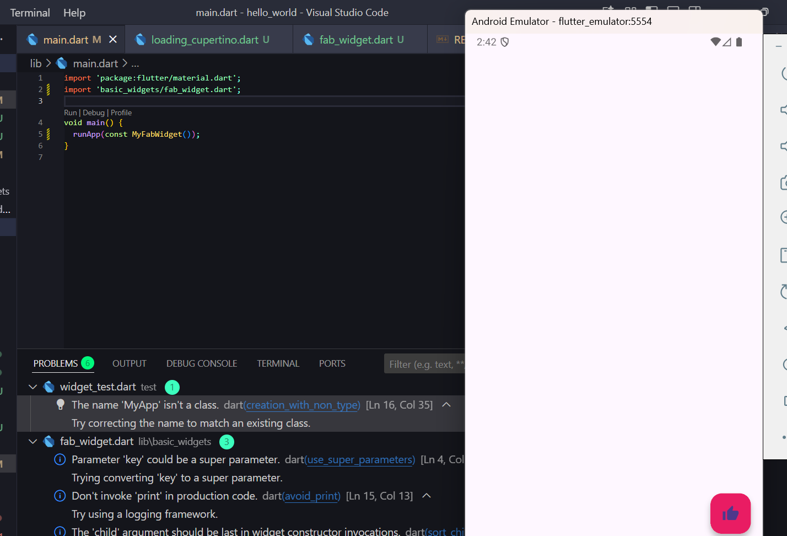  

---

## 🏗️ Langkah 3: Scaffold Widget  

Output Scaffold Widget:  
- AppBar dengan judul **My Increment App**  
- Teks: *“You have pushed the button this many times:”*  
- Angka counter (awal = 0)  
- BottomAppBar kosong  
- FAB (+) di tengah bawah  
- Tekan tombol `+` → angka counter bertambah  

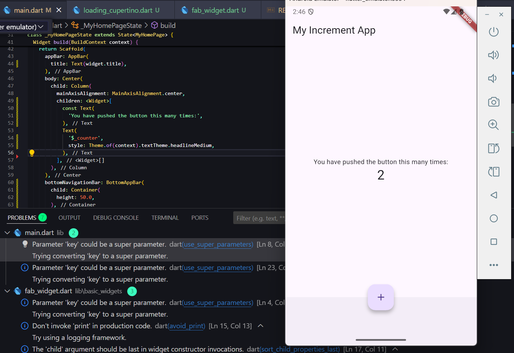  

---

## 💬 Langkah 4: Dialog Widget  

1. **AlertDialog**  
   - Tombol “Show” untuk menampilkan informasi.  
   - Output:  
     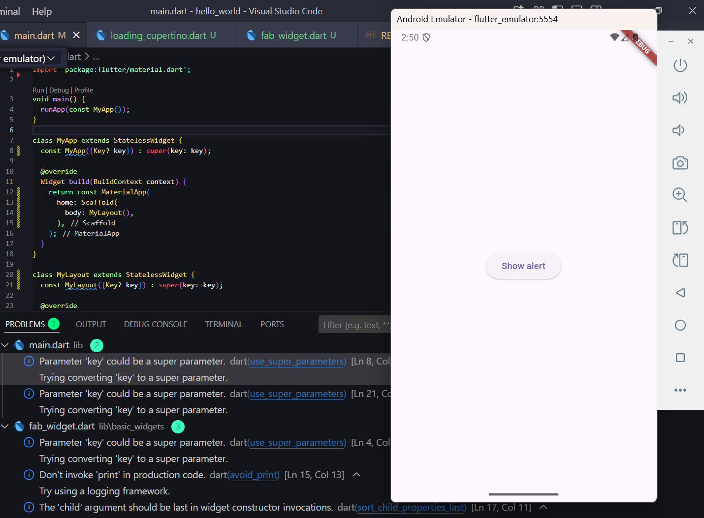  
     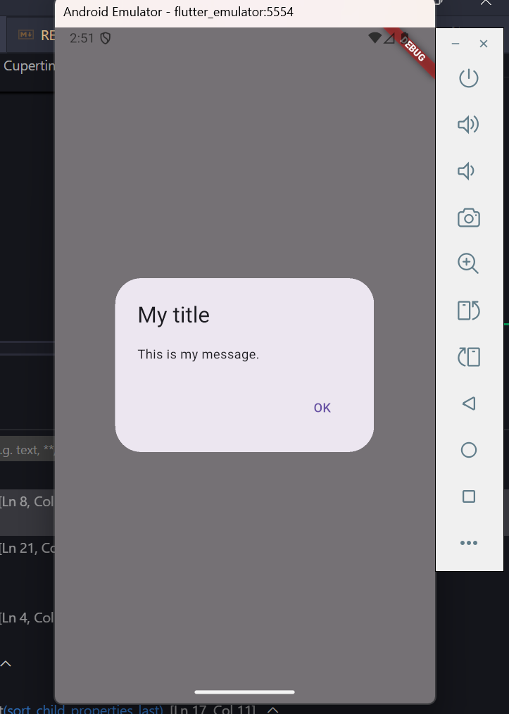  

2. **SimpleDialog**  
   - Output awal: tombol “Open SimpleDialog” di tengah.  
   - Jika ditekan → popup SimpleDialog muncul dengan 3 opsi.  
   - Klik salah satu opsi → dialog tertutup.  
   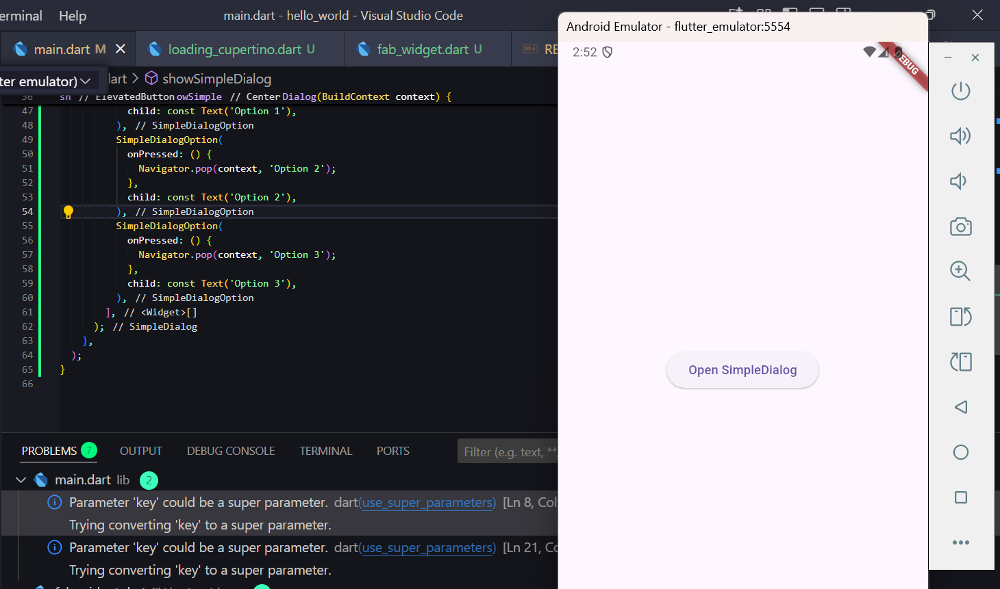  
   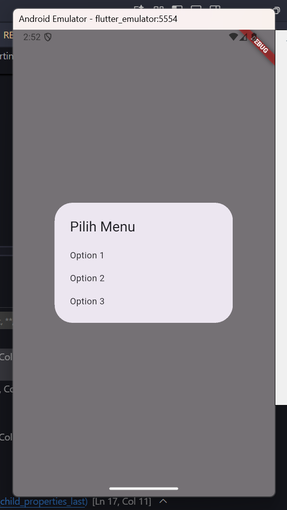  

**Perbedaan:**  
- *AlertDialog*: konfirmasi/peringatan.  
- *SimpleDialog*: memilih opsi.  

---

## 🍫 Langkah 5: SnackBar  

1. Buat tombol “Show SnackBar”.  
2. Jika ditekan → muncul SnackBar dengan teks *“Halo, ini SnackBar!”*.  
3. Ada tombol aksi **Tutup**.  
4. SnackBar hilang otomatis setelah 3 detik.  

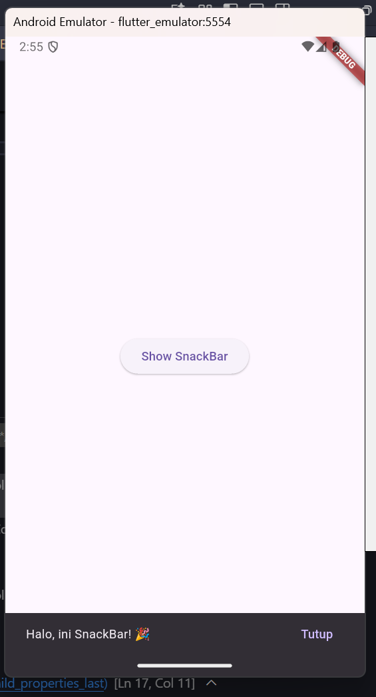  

---

## 📌 Kesimpulan  

Praktikum ini membahas pembuatan project Flutter baru, pengaturan emulator Android Studio, pembuatan repository GitHub untuk versioning, serta penerapan berbagai widget dasar Flutter seperti Text, Image, Scaffold, Dialog, SnackBar, hingga widget bergaya Material Design dan Cupertino. Dengan praktikum ini, peserta memperoleh pemahaman menyeluruh mulai dari setup lingkungan pengembangan, pengelolaan kode, hingga implementasi antarmuka pengguna dasar pada aplikasi Flutter.  

---

