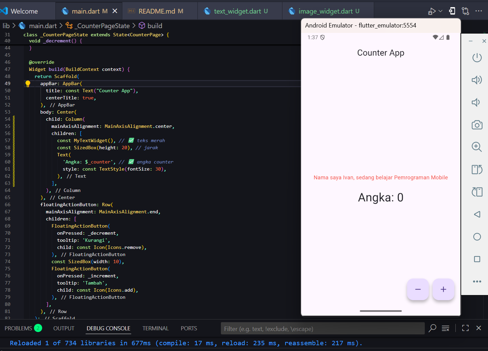
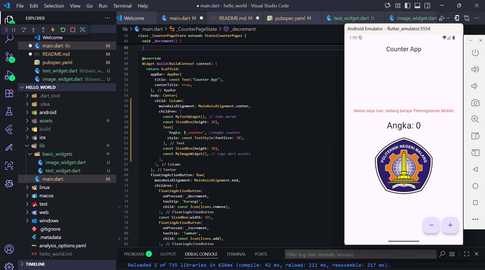

# hello_world Project

# Praktikum 1: Membuat Project Flutter baru

ketik di command palette flutter , lalu klik Flutter:new

setelah itu pilih yang application

Lalu memilih folder untuk menyimpan flutter nya, disini saya memakai nama hello world

Lalu flutter siap digunakan untuk project anda

# Praktikum 2: Setup Emulator

disini saya menggunakan Android Studio untuk emulator saya

masuk ke bagian setting lalu download sdk dan plugin yang dibutuhkan

Android Studio juga bisa custom untuk tampilan emulator nya, saya memilih sebagai berikut

Lalu setelah custom kita coba untuk emulator nya, apakah bisa jalan

berhasil berjalan untuk emulator nya, lalu kita coba untuk memakai aplikasi flutter di emulator nya

# Praktikum 3: Membuat Repository Dan Laporan Menggunakan README

Membuat Repository baru, dan hubungkan dengan folder hello world flutter ini

berhasil push project dan repository

# Praktikum 4: Menerapkan Widget Dasar

Membuat folder dan file baru untuk widget

mengisi file widget

memodifikasi file main.dart 

Lalu untuk Hasil Output nya adalah sebagai berikut 

Kita lanjutkan ke praktikum yang memuat gambar logo

pertama tama kita membuat file baru lagi di folder basic_widget

setelahnya kita mengatur lokasi logo nya dan membuat folder asset, jangan lupa untuk memodifikasi file pubspec.yaml

isikan file dengan kode yang telah ada

modifikasi main.dart nya agar sesuai untuk output nya

untuk output nya adalah seperti berikut

# Praktikum 5: Menerapkan Widget Material Design dan IOS Cupertino

This project is a starting point for a Flutter application.

A few resources to get you started if this is your first Flutter project:

- [Lab: Write your first Flutter app](https://docs.flutter.dev/get-started/codelab)
- [Cookbook: Useful Flutter samples](https://docs.flutter.dev/cookbook)

For help getting started with Flutter development, view the
[online documentation](https://docs.flutter.dev/), which offers tutorials,
samples, guidance on mobile development, and a full API reference.
